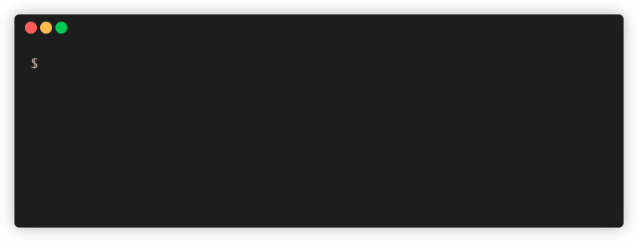

# Salami CLI
![coverage][coverage_badge]
[![License: MIT][license]](license_link)
[![style: very_good_analysis_link][badge]][badge_link]

A Salami Command Line Interface for Dart.
<br><br>


<div style="text-align:center">
  
</div>
<br>


## What is salami_cli 🤔

Salami is an open source command line tool that generates supercharged flutter project from template called salami.
The motivation behind creating salami_cli comes from the need of a tool that accelerates process of configuring and maintaining flutter application on every step of app development.

<br>
<div style="text-align:center">
  
</div>
<br>


## What does salami provides?

🦄 VGV inspired project structure

🛫 First launch callback 

🧪 Configured melos for running test across all packages

🌐 Already configured l10n to work with translations

🎨 Theme package for defining app look

😋 Flavors for building app in development, staging and production

🔔 Firebase messaging notification manager

🔌 Extension for diffrent data types (more to come)

## Installing

```sh
dart pub global activate salami_cli
```

## Commands

See the complete list of commands and usage information.

```sh
🚀 A Salami Command Line Interface
Usage: salami <command> [arguments]
Global options:
-h, --help       Print this usage information.
    --version    Print the current version.
Available commands:
  create   Creates a new salami flutter application in seconds.
  init     Install usefull dart cli tools
  spit     Create a new flutter component in seconds.
Run "salami help <command>" for more information about a command.
```

#### Usage

```sh
# Create a new Flutter app in current directory
salami create .

# Create a new Flutter app in passed directory
salami create ./foo/bar

# Install all cli tools used in salami core lika coverde, melos etc.
salami init

# Create flutter page with cubit and tests.
salami spit page -n home
```

---

[coverage_badge]: https://raw.githubusercontent.com/VeryGoodOpenSource/very_good_cli/main/coverage_badge.svg
[badge]: https://img.shields.io/badge/style-very_good_analysis-B22C89.svg
[badge_link]: https://pub.dev/packages/very_good_analysis
[license]: https://img.shields.io/badge/license-MIT-blue.svg
[license_link]: https://opensource.org/licenses/MIT
[very_good_analysis_link]: https://github.com/VeryGoodOpenSource/very_good_analysis
[dev_talents_link]: https://unitedideas.co/
